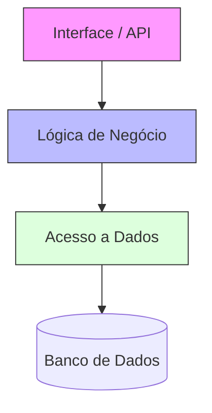
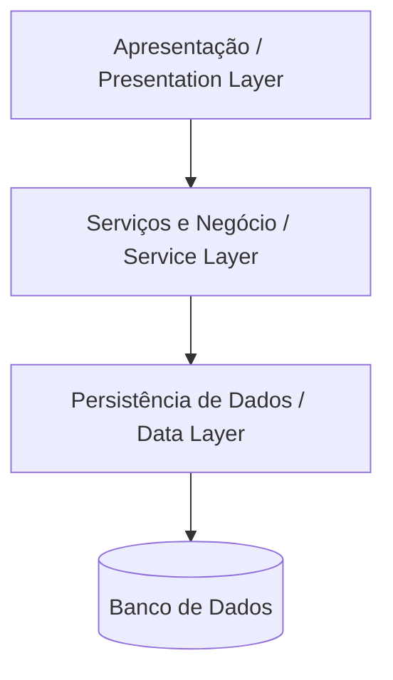
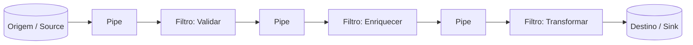
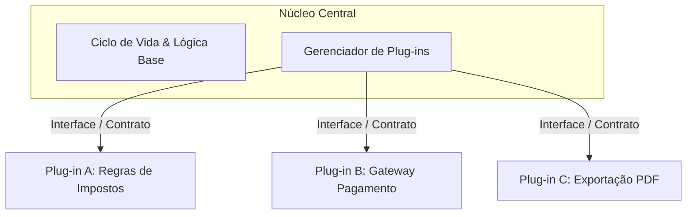

# 📖 Estilos Arquiteturais: Monólitos e Arquitetura em Camadas

## 🏢 1. Sistemas Monolíticos

### 🎯 Conceito Detalhado
A **Arquitetura Monolítica** é uma abordagem onde todos os módulos e componentes funcionais de um software (interface, lógica de negócio e acesso a dados) estão contidos em um único código-fonte e são implantados (*deployed*) como um **único artefato executável**.

⚖️ Vantagens e Desvantagens
Vantagens:

Desenvolvimento e Teste Simplificados: Execução local simples e depuração (debug) centralizada.

Deploy Inicial Descomplicado: Envio de apenas um pacote executável ao ambiente de produção.

Baixa Latência Interna: Chamadas de método ocorrem em memória, sem depender da rede.

Desvantagens:

Escalabilidade Ineficiente: Exige duplicar a instância da aplicação inteira para suportar carga em um único módulo.

Alto Acoplamento: Mudar uma funcionalidade pode gerar efeitos colaterais em partes não relacionadas.

Ciclos de Deploy Arriscados: Qualquer atualização exige o redeploy e a reinicialização do sistema inteiro.

## 🥞 2. Arquitetura em Camadas (Layered Architecture)
🎯 Conceito
A Arquitetura em Camadas divide o sistema em níveis horizontais de responsabilidade (Separation of Concerns). Cada nível isola um papel específico da aplicação e consome apenas a camada imediatamente abaixo.

🧱 Estrutura das Camadas
Presentation Layer (Apresentação): Interage com o usuário ou expõe as rotas HTTP da API (Controllers).

Service / Business Logic Layer (Serviços e Negócio): Executa as validações, regras de negócio e fluxos da aplicação.

Data / Persistence Layer (Dados e Persistência): Conecta ao banco de dados e executa operações de leitura e escrita (ORMs e Repositories).

⚖️ Vantagens e Desvantagens

Vantagens:

Isolamento de Responsabilidades: Facilita manutenções ao garantir que cada camada foque apenas em seu papel.

Reutilização de Regras: A camada de negócios pode servir múltiplos clientes (Aplicações Web, Mobile, Integrações).

Trabalho em Equipe: Desenvolvedores podem atuar em camadas distintas simultaneamente sem gerar conflitos diretos.

Desvantagens:

Efeito Sinkhole: Operações simples de leitura (CRUDs básicos) atravessam todas as camadas sem processar regras de negócio, gerando código repetitivo.

Overhead de Desempenho: A conversão contínua de modelos entre camadas consome etapas adicionais de memória e CPU.

Implantação Acoplada: Na maioria das implementações, todas as camadas continuam empacotadas no mesmo executável.

# 📖 Arquitetura Pipes and Filters

## 🎯 Conceito Detalhado
A **Arquitetura Pipes and Filters** (Tubos e Filtros) é um estilo estrutural voltado para o processamento sequencial de fluxos de dados. O sistema é dividido em pequenos componentes independentes de processamento (**Filtros**) conectados por canais de comunicação unidirecionais (**Pipes**).

Este estilo segue o princípio da fábrica: os dados são transformados gradualmente à medida que transitam por cada estágio do pipeline.

🧱 Componentes Fundamentais
Filter (Filtro):

Papel: Unidade autônoma de processamento.

Responsabilidade: Recebe o dado do pipe de entrada, realiza uma transformação pontual (filtra, limpa, valida ou enriquece) e envia o resultado para o pipe de saída. Não possui dependência do estado global da aplicação.

Pipe (Tubo):

Papel: Conector ou canal de transporte.

Responsabilidade: Direciona o fluxo de dados entre os filtros, garantindo o isolamento entre eles.

Source e Sink (Origem e Destino):

Source: Ponto de entrada gerador dos dados (ex: leitura de arquivos, sensores IoT, filas de mensagens).

Sink: Ponto final onde o dado processado é armazenado ou consumido (ex: Banco de Dados, Data Warehouse, API externa).

⚖️ Vantagens e Desvantagens
Vantagens:

Alta Reutilização: Filtros são totalmente desacoplados e podem ser recombinados para criar novos pipelines.

Alta Testabilidade: É simples criar testes isolados para a lógica de cada filtro.

Processamento Paralelo: Permite que múltiplos filtros processem partes diferentes do fluxo simultaneamente (concorrência).

Desvantagens:

Overhead de Parsing: Constantes conversões e serializações de dados entre os filtros podem reduzir o desempenho.

Complexidade no Tratamento de Erros: Exige estratégias cuidadosas para lidar com falhas parciais ocorridas no meio da execução da cadeia.

# 📖 Arquitetura Microkernel (Plug-In Architecture)

## 🎯 Conceito Detalhado
A **Arquitetura Microkernel** (ou Arquitetura baseada em Plug-ins) é um estilo estrutural projetado para criar aplicações extensíveis e adaptáveis. O sistema é dividido em dois pilares fundamentais: um **Núcleo Central (Core System)** enxuto e múltiplos **Módulos Plug-in** independentes.

O núcleo é responsável por manter a aplicação rodando e expor contratos/interfaces para que as funcionalidades adicionais sejam acopladas dinamicamente.

### 🧱 Componentes Fundamentais
Núcleo Central (Core System):

Papel: Sistema base minimalista.

Responsabilidade: Contém a inicialização do sistema, regras básicas de navegação, gerenciamento do ciclo de vida dos plug-ins e o registro de rotas/interfaces. Não deve conter regras de negócio complexas ou específicas.

Módulos Plug-in:

Papel: Componentes autônomos de funcionalidade.

Responsabilidade: Adicionar capacidades, telas, algoritmos ou integrações extras ao sistema base, consumindo os contratos expostos pelo núcleo.

Contratos / Interfaces:

Papel: Camada de integração.

Responsabilidade: Padronizar como o núcleo chama o plug-in e como o plug-in acessa os recursos do núcleo, garantindo o desacoplamento.

### ⚖️ Vantagens e Desvantagens
Vantagens:

Alta Extensibilidade e Flexibilidade: Permite adicionar ou remover recursos sem alterar a base de código do núcleo central.

Isolamento de Falhas: Erros ocorridos dentro de um plug-in podem ser isolados para evitar que a aplicação inteira pare de funcionar.

Evolução Independente: Equipes distintas podem construir, testar e publicar plug-ins de forma paralela.

Desvantagens:

Complexidade no Design Inicial: Exige um design rigoroso da API/Interface interna que conectará os plug-ins ao núcleo.

Desafio de Versionamento: Alterações na estrutura do núcleo podem quebrar a compatibilidade com plug-ins legados ou de terceiros.

### 💻 Exemplos Reais de Aplicação
IDEs e Editores de Código: VS Code, Eclipse e IntelliJ (onde sintaxes de linguagens e ferramentas de depuração são carregadas via extensões).

Processamento de Regras de Negócio: Sistemas e-commerce onde cálculos de frete, regras tributárias e métodos de pagamento variam por região e são carregados como plug-ins.

Navegadores Web: Google Chrome e Firefox (com o ecossistema de extensões de usuário).