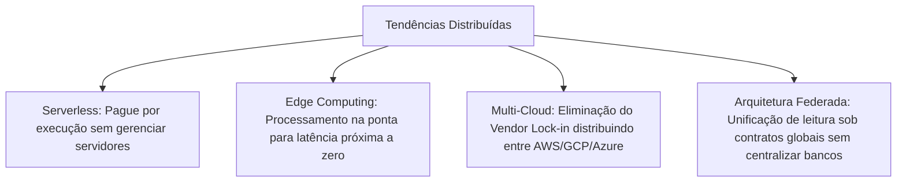
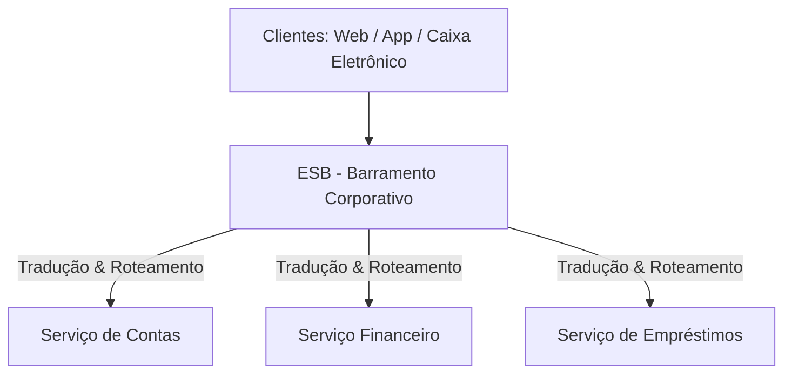
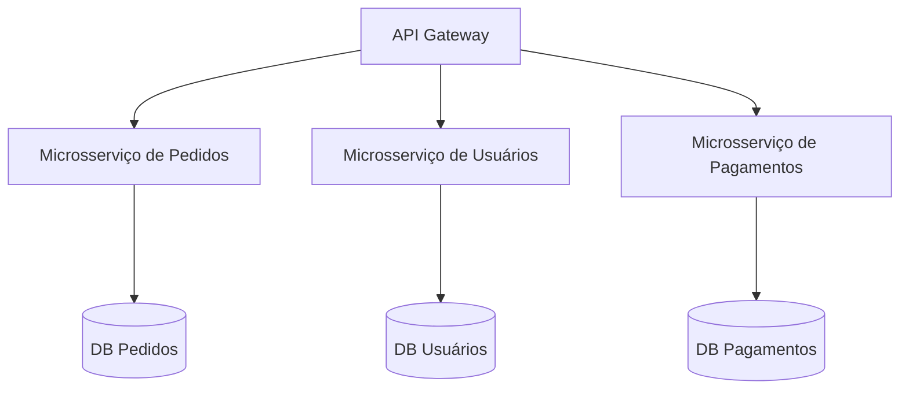
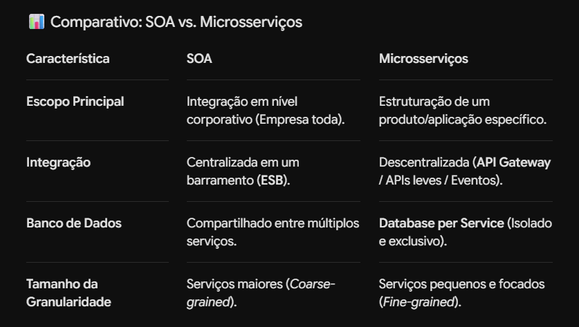
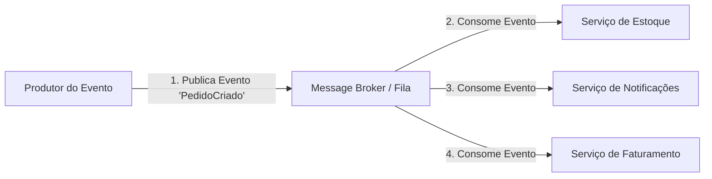

# Estilos Arquiteturais Distribuídos

## 🌐 5.1 Conceitos Gerais, Desafios e Tendências

### 🎯 Conceito Detalhado
A **Arquitetura Distribuída** divide uma aplicação em múltiplos componentes independentes executados em processos, contêineres ou servidores distintos conectados via rede. Diferente dos monólitos, permite atualizações e implantações (*deploys*) de forma incremental e descentralizada.

---

### 🧱 As 6 Características Fundamentais

| Características | Descrição Prática |
| :--- | :--- |
| **1. Distribuição** | Módulos e serviços executados em nós/servidores fisicamente separados. |
| **2. Descentralização** | Responsabilidade de execução e dados divididos entre os serviços (sem ponto único de controle). |
| **3. Comunicação por Rede** | Troca de dados via protocolos leves (HTTP/REST, gRPC) ou mensagens (Kafka, RabbitMQ). |
| **4. Tolerância a Falhas** | Resiliência estrutural: a queda de uma parte não derruba a aplicação inteira. |
| **5. Escalabilidade Horizontal** | Crescimento de capacidade via adição de novas instâncias paralelas (*Scale-Out*). |
| **6. Heterogeneidade** | Liberdade para adotar linguagens e bancos de dados distintos por serviço (*Polyglot Persistence*). |

---

### ⚠️ Desafios vs. 🔮 Tendências Emersas

#### Desafios Técnicos:
* **Complexidade Operacional:** Exige observabilidade avançada (Logs centralizados, Métricas e Tracing Distribuído).
* **Latência de Rede:** Chamadas via rede introduzem gargalos de tempo inexistentes em chamadas de memória.
* **Gestão de Estado:** Manter dados consistentes entre múltiplos bancos exige estratégias como Consistência Eventual.

#### Tendências do Mercado:

# 🚌 5.2 Arquitetura Orientada a Serviços (SOA)
🎯 Conceito
A SOA (Service-Oriented Architecture) é um estilo arquitetural corporativo focado em integrar diferentes sistemas e aplicações de uma organização por meio de serviços de negócio reutilizáveis.

## 🔀 O Papel do ESB (Enterprise Service Bus)
O ESB é o middleware centralizador responsável por:

Roteamento: Direcionar as chamadas para os serviços de destino corretos.

Tradução (Transformação): Converter formatos de dados (ex: transformar dados de JSON para XML em tempo de execução).

Segurança e Auditoria: Centralizar o controle de acesso e o registro de logs de integração.

### ⚖️ Prós e Contras do SOA
Vantagens: Reutilização em grande escala de serviços corporativos, facilidade de integração de sistemas legados e padronização da comunicação.

Desvantagens: Alto risco de o ESB se tornar um gargalo de desempenho e um ponto único de falha (Single Point of Failure), além da altíssima complexidade de governança.

# 🧩 5.3 Arquitetura de Microsserviços

## 🎯 Conceito

Estilo focado em construir uma única aplicação como um conjunto de pequenos serviços autônomos. Cada microsserviço é responsável por um domínio de negócio específico e roda em seu próprio processo.

### 🧱 As 3 Regras de Ouro

Database per Service: Cada microsserviço possui e gerencia seu próprio banco de dados isolado.

Comunicação Descentralizada: Ausência de barramentos pesados (ESB); comunicação via APIs HTTP/REST, gRPC ou mensageria leve.

Deploy Independente: Alterações e implantações em um serviço não impactam a disponibilidade dos demais.

### 🛅 Característica,SOA,Microsserviços

~

### ⚖️ Prós e Contras dos Microsserviços

Vantagens: Altíssima flexibilidade de deploy, escalabilidade cirúrgica por serviço e forte isolamento de falhas.

Desvantagens: Perda de transações ACID locais (exige Consistência Eventual e Saga Pattern), alta complexidade operacional e risco de despadronização entre times.

# ⚡5.4 Arquitetura Orientada a Eventos (EDA) 

### 🎯 Conceito

A Event-Driven Architecture (EDA) é um estilo baseado no processamento assíncrono de notificações de mudança de estado (Eventos). Componentes da aplicação reagem aos eventos gerados no sistema sem dependência direta de tempo ou sincronismo.

## 🧱 Componentes Principais

Event Producer (Produtor): Emite a notificação de que um fato ocorreu no sistema. Não sabe quem irá consumir a mensagem.

Event Broker (Intermediário): Middleware que armazena e distribui os eventos (ex: RabbitMQ, Apache Kafka).

Event Consumer (Consumidor): Escuta o broker e executa ações de negócio assíncronas ao receber o evento.

## ⚖️ Prós e Contras do EDA

Vantagens: Extremo desacoplamento de tempo e espaço, alta capacidade de resposta (responsiveness), alta escalabilidade e resiliência a falhas temporárias dos consumidores.

Desvantagens: Complexidade no rastreamento de fluxos (Distributed Tracing), gerenciamento de estados temporários e garantia de entrega/ordenação de mensagens.