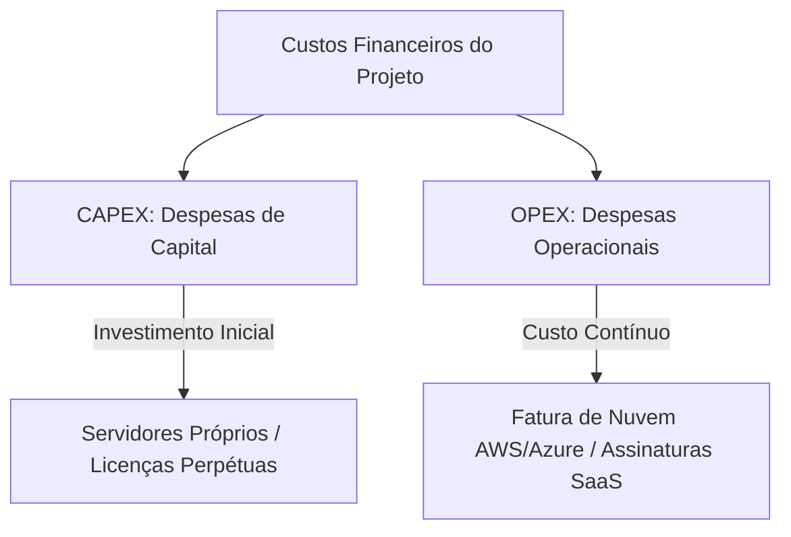

# 📖 Conduzindo um Processo Decisório em Arquitetura de Software

## 🎯 1. O Papel do Arquiteto no Processo Decisório

O papel do arquiteto de software consiste em **ajudar, facilitar e conduzir** o processo de tomada de decisão técnica. Sua meta não é impor preferências tecnológicas pessoais ou seguir modismos, mas sim orientar o time e os *stakeholders* por meio de uma análise lógica e estruturada para encontrar a solução de maior valor para o negócio dentro dos limites do projeto.

---

## 📊 2. Matriz de Decisão

A **Matriz de Decisão** é uma ferramenta quantitativa que ajuda a tomar decisões de forma objetiva, eliminando o viés pessoal e o "achismo". Ela consiste em listar critérios técnicos, financeiros e operacionais, atribuir pesos de importância para o negócio e pontuar cada alternativa analisada.

### 🧱 Etapas Fundamentais para Montagem:
1. **Definir as Alternativas:** Listar claramente as tecnologias ou soluções concorrentes.
2. **Selecionar Critérios Relevantes:** Mapear fatores críticos (Desempenho, Custo, Manutenibilidade, Facilidade).
3. **Atribuir Pesos aos Critérios (1 a 5):** Definir o nível de relevância de cada critério para o projeto.
4. **Avaliar e Pontuar (1 a 5):** Atribuir uma nota para a capacidade de cada alternativa em atender ao critério.
5. **Calcular a Pontuação Final:** Multiplicar o peso pela nota de cada critério e somar o total ($Result = \text{Peso} \times \text{Nota}$).

### 💡 Exemplo Prático: Comparativo RabbitMQ vs. Apache Kafka

| Critério de Avaliação | Peso (1-5) | Nota RabbitMQ (1-5) | Total RabbitMQ | Nota Apache Kafka (1-5) | Total Kafka |
| :--- | :---: | :---: | :---: | :---: | :---: |
| **Facilidade de Implementação** | 5 | 5 | 25 | 3 | 15 |
| **Alta Vazão de Mensagens (Throughput)** | 4 | 3 | 12 | 5 | 20 |
| **Curva de Aprendizado do Time** | 3 | 4 | 12 | 2 | 6 |
| **Suporte a Roteamento Complexo** | 4 | 5 | 20 | 2 | 8 |
| **PONTUAÇÃO FINAL** | -- | -- | **69** | -- | **49** |

> **Resultado do Exemplo:** No cenário acima, o **RabbitMQ** obteve a maior pontuação por priorizar critérios de simplicidade e roteamento complexo no contexto do projeto.

---

## 📌 3. Premissas e Restrições

Toda decisão arquitetural é tomada sob condições de incerteza e limitações operacionais. É papel do arquiteto identificar e documentar essas variáveis com clareza.

### 🔹 Premissas (Assumptions)
São hipóteses ou suposições tomadas como verdadeiras no momento presente para permitir o planejamento, mesmo sem ter garantia e controle absoluto no futuro.
* **Exemplo em TI:** *"Assume-se que o volume inicial de requisições do sistema não ultrapassará 10.000 usuários ativos simultâneos no primeiro ano de operação."*

### 🔹 Restrições (Constraints)
São limitações rígidas, inegociáveis e obrigatórias impostas pelo negócio, pela infraestrutura existente, pelo orçamento ou pela legislação.
* **Exemplo em TI:** *"O sistema deve ser desenvolvido obrigatoriamente em conformidade estrita com a LGPD e o orçamento de infraestrutura não pode exceder R$ 5.000/mês."*

---

## 💰 4. Análise de Custo e ROI: CAPEX vs. OPEX

Ao conduzir uma decisão técnica, o arquiteto deve garantir a viabilidade financeira da solução analisando não apenas os custos imediatos, mas também os operacionais de longo prazo para garantir um Retorno sobre o Investimento (ROI) saudável.

### 💸 CAPEX (Capital Expenditure - Despesas de Capital)
Conceito: Refere-se aos investimentos financeiros iniciais e de grande porte feitos na aquisição de bens físicos ou ativos de longo prazo (Upfront).

Aplicação em TI: Compra de servidores físicos (bare-metal) para Data Center próprio, equipamentos de rede ou aquisição de licenças de software perpétuas.

### 🔄 OPEX (Operational Expenditure - Despesas Operacionais)
Conceito: São os custos contínuos e recorrentes necessários para manter a solução rodando e operando no dia a dia do negócio.

Aplicação em TI: Faturas mensais de consumo em nuvem (AWS, Google Cloud, Azure), contratação de serviços SaaS, custos de manutenção de rede e suporte técnico.

### 🚗 Analogia
🏢 1. O Arquiteto como um Juiz de Tribunal
O arquiteto não cria as leis e nem inventa os fatos; ele analisa imparcialmente as provas (critérios técnicos), ouve o Ministério Público e a Defesa (desenvolvedores e diretores de negócio), avalia os limites do código penal (restrições) e emite uma sentença fundamentada (Matriz de Decisão e ADR) justificando o motivo da escolha.