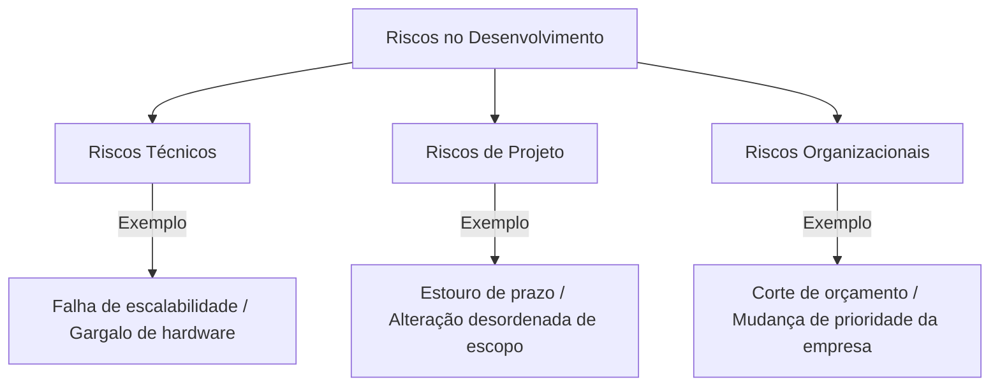
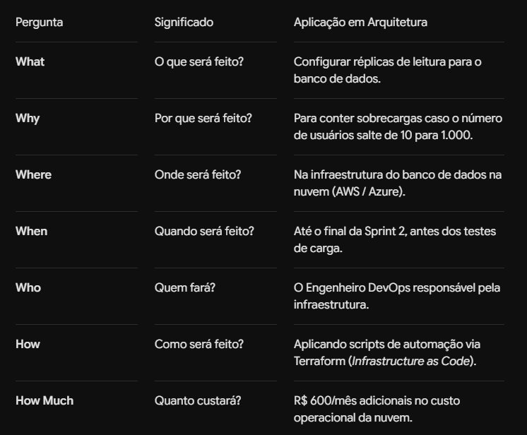

# 📖 Gerenciamento de Riscos em Arquitetura de Software

## 🎯 1. Conceito: Riscos vs. Oportunidades

No gerenciamento de projetos e arquitetura de software, lidamos constantemente com incertezas:

* **Risco:** Evento incerto que, se ocorrer, provoca impactos **negativos** (prejuízos financeiros, quedas de serviço, perda de dados ou danos à reputação).
* **Oportunidade:** Evento incerto que, se concretizado, gera impactos **positivos** (redução de custos, ganho de desempenho ou entrega antecipada).

---

## ⚠️ 2. Tipos de Riscos

**Riscos Técnicos**: Falhas de arquitetura, incompatibilidade de bibliotecas, ausência de escalabilidade e falhas de segurança.

**Riscos de Projeto**: Problemas na condução das entregas, estimativas incorretas de prazos e alocação inadequada de pessoas.

**Riscos Organizacionais**: Impactos vindos da gestão estratégica da empresa, como fusões, restrições financeiras ou reestruturação de times.

### 🔍 3. Como Identificar Riscos na Arquitetura
O arquiteto atua preventivamente para evitar falhas em produção por meio do mapeamento do sistema e uso de ferramentas analíticas:

### 🛠️ Ferramentas de Identificação:
Análise SWOT (FOFA): Estrutura que avalia Forças (Strengths) e Fraquezas (Weaknesses) internas da arquitetura, junto às Oportunidades (Opportunities) e Ameaças (Threats) externas.

Diagramas de Fluxo e Casos de Uso: Mapeamento do caminho que as requisições e dados percorrem para identificar gargalos de processamento, falhas de integração com APIs externas e Pontos Únicos de Falha (SPOF - Single Point of Failure).

### 📊 4. Classificação de Riscos
A priorização de um risco é determinada através da combinação de duas variáveis fundamentais:

Nivel do Risco = Probabilidade x Impacto

Probabilidade de Ocorrência: A chance estimada de o evento acontecer (avaliada pelo histórico de incidentes, complexidade técnica e dados estatísticos). Escala de 1 (Baixa) a 5 (Alta).

Impacto ou Consequência: A severidade dos prejuízos operacionais, financeiros ou reputacionais caso o evento se concretize. Escala: Insignificante, Moderado, Crítico/Catastrófico.

### 🛡️ 5. Tratamento de Riscos com a Ferramenta ROAM
Após a identificação e classificação, utiliza-se a abordagem ROAM para definir o direcionamento técnico de cada risco:

R - Resolved (Resolvido): A vulnerabilidade ou falha foi eliminada do projeto por meio de alteração de código ou infraestrutura.

O - Owned (Assumido / Com Dono): O risco não pode ser resolvido imediatamente, mas foi atribuído a um responsável específico para monitoramento contínuo.

A - Accepted (Aceito): O risco é compreendido, mas o custo financeiro ou operacional para resolvê-lo é superior ao impacto do dano. A equipe aceita as consequências caso ocorra.

M - Mitigated (Mitigado): Ações técnicas são implementadas para reduzir a probabilidade de ocorrência ou atenuar o impacto negativo.

### 📝 6. Plano de Ação para Mitigação (5W2H)

# 🚗 Analogia

✈️ Piloto de Avião e Planejamento de Voo
Risco vs. Oportunidade:

Risco: Entrar em uma área de tempestade (evento prejudicial que pode danificar a aeronave).

Oportunidade: Encontrar uma corrente de vento a favor que reduz o tempo de voo e economiza combustível.

Diagramas de Fluxo (Checklist pré-voo): O piloto inspecionando cada componente do avião antes da decolagem para encontrar falhas mecânicas preventivamente.

Classificação ROAM no Painel de Controle:

Resolved: Trocar uma peça defeituosa identificada antes da decolagem.

Owned: Atribuir ao co-piloto a tarefa de checar o nível de combustível a cada 30 minutos.

Accepted: Aceitar uma leve turbulência em altitude de cruzeiro sem alterar a rota original.

Mitigated: Desviar ligeiramente o curso da aeronave para contornar a tempestade e minimizar os riscos ao voo.

Plano 5W2H: O plano de voo oficial entregue à torre de controle detalhando a rota alternativa, quem comanda a aeronave, onde pousar em emergências e quanto combustível reserva foi abastecido.
