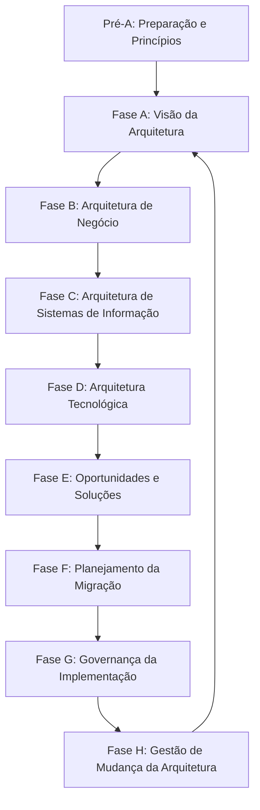

# 📖 Arquitetura Corporativa: TOGAF vs. Zachman Framework

## 🎯 1. Conceito de Arquitetura Corporativa (EA)

A Arquitetura Corporativa alinha os objetivos estratégicos de negócio da empresa às suas tecnologias, dados e processos de software. Para organizar esse ecossistema complexo, utilizam-se frameworks de referência:

* **Zachman Framework:** Estrutura de classificação bidimensional (taxonomia) que categoriza todos os artefatos da empresa.
* **TOGAF (The Open Group Architecture Framework):** Framework baseado em processos que fornece uma metodologia prática para criar, manter e governar a arquitetura.

---

## 🏛️ 2. Zachman Framework (A Ontologia)

O Zachman não é uma metodologia de desenvolvimento, mas uma **matriz de $6 \times 6$** que garante que todos os pontos de vista e aspectos de um sistema foram considerados sem omitir detalhes operacionais ou estratégicos.

### 📐 As Dimensões da Matriz Zachman:

1. **Linhas (Perspectivas dos Stakeholders):**
   * **Escopo (Planner):** Visão contextual do negócio e limites da organização.
   * **Modelo de Negócio (Owner):** Visão conceitual das operações e processos.
   * **Modelo do Sistema (Designer):** Visão lógica dos requisitos e arquitetura de software.
   * **Modelo Tecnológico (Builder):** Visão física de infraestrutura, bancos de dados e linguagens.
   * **Componentes Detalhados (Subcontractor):** Visão fora de contexto/especificações de fornecedores.
   * **Instância Funcional (User):** O sistema em operação real.

2. **Colunas (Abstrações / Perguntas Fundamentais):**
   * **What (O que):** Dados e informações da empresa.
   * **How (Como):** Processos e funções executadas.
   * **Where (Onde):** Redes, locais e distribuições geográficas.
   * **Who (Quem):** Pessoas, papéis e organizações envolvidas.
   * **When (Quando):** Eventos, fluxos de tempo e ciclos de vida.
   * **Why (Por que):** Motivações, regras de negócio e estratégias.

---

## 🔄 3. TOGAF (A Metodologia Iterativa)

O coração do TOGAF é o **ADM (*Architecture Development Method*)**, um ciclo iterativo de 8 fases para planejamento, desenvolvimento e governança da arquitetura.

## 🛠️ Fases do ADM (TOGAF):
Fase A (Visão da Arquitetura): Define o escopo, limites e aprovação dos patrocinadores.

Fase B (Arquitetura de Negócio): Mapeia os processos atuais (As-Is) e desejados (To-Be).

Fase C (Sistemas de Informação): Divide-se em Arquitetura de Dados e Arquitetura de Aplicações.

Fase D (Arquitetura Tecnológica): Define infraestrutura, redes, hardware e serviços de nuvem.

Fase E & F (Oportunidades e Migração): Avalia custos, roadmap e priorização do plano de transição.

Fase G & H (Governança e Mudança): Garante a conformidade do projeto e trata modificações contínuas.

# 🚗 Analogia
🏗️ Construção de um Arranha-Céu
Zachman Framework (A Planta e a Pasta de Arquivos do Engenheiro):
É a pasta sanfonada com as gavetas rotuladas. Uma gaveta tem a visão do dono do prédio (Quanto vai custar e para que serve), outra tem a visão do eletricista (Diagrama elétrico do 3º andar), e outra tem a visão do encanador (Mapeamento da tubulação). Ele garante que você não esqueça nenhum detalhe da construção.

TOGAF (O Cronograma de Obras e a Gestão da Empreiteira):
É o manual do mestre de obras. Ele dita as etapas: primeiro faz a sondagem do solo (Fase A), depois desenha o projeto (Fases B, C, D), planeja a compra de materiais (Fases E, F) e monitora os pedreiros para garantir que a obra não saia do padrão (Fases G, H).