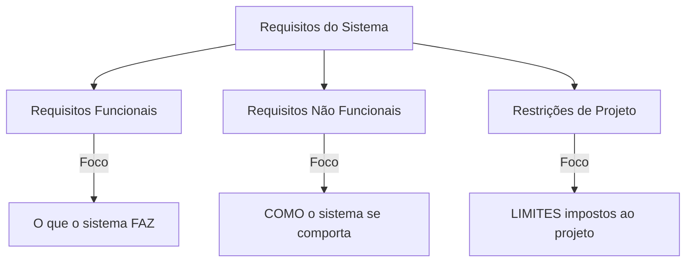
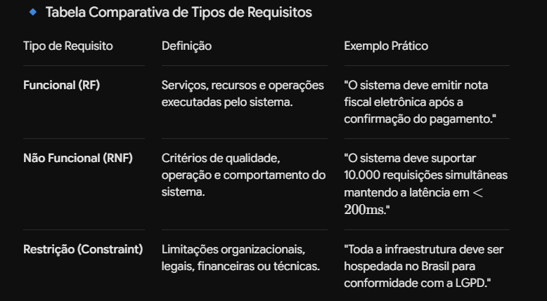

# 📖 Fundamentos e Elicitação de Requisitos Arquiteturais

## 🎯 1. O que é Engenharia de Requisitos na Arquitetura?

A Engenharia de Requisitos é a disciplina responsável por elicitar, analisar, documentar e validar as necessidades do negócio, transformando expectativas de *stakeholders* em especificações técnicas testáveis.

Na arquitetura de software, o foco principal está nos **ASRs (*Architecturally Significant Requirements*)** — requisitos que impõem restrições profundas à estrutura do sistema e cujas mudanças custam caro após a implementação.

---

## ⚠️ 2. Classificação Geral dos Requisitos

### 🔍 3. Identificando Requisitos Arquiteturalmente Significativos (ASRs)

*Alto Impacto Estrutural*: Exige escolhas complexas de infraestrutura ou padrão de arquitetura (ex: migrar de monolito para microsserviços).

*Alto Custo de Mudança*: Alterar essa decisão no futuro causará grande refatoração de código.

*Prioridade de Negócio*: Vital para a sobrevivência comercial do produto.

### 📐 Atributos de Qualidade Comuns em ASRs:

*Desempenho (Performance)*: Tempo de resposta e taxa de transferência (throughput).Escalabilidade: Capacidade de absorver crescimento de carga (horizontal ou vertical).*Disponibilidade*: Percentual de tempo de operação (ex: "três noves" $= 99.9\%$).
*Segurança*: Autenticação, autorização, integridade de dados e auditoria.
*Manutenibilidade*: Facilidade de alterar o sistema sem introduzir regressões.

# 📝 5. Documentação de Cenários de Atributos de Qualidade

Para evitar ambiguidades (como usar termos genéricos: "o sistema deve ser rápido"), os ASRs devem ser documentados como Cenários de Qualidade de 6 Partes:

1. Fonte do Estímulo: Quem ou o que gera a ação (ex: Usuário Anônimo).
2. Estímulo: O evento que dispara a reação (ex: Tenta realizar login).
3. Artefato: A parte afetada do sistema (ex: Serviço de Autenticação).
4. Ambiente: As condições do momento (ex: Sob carga normal de operação).
5. Resposta: O comportamento esperado (ex: Sistema valida credenciais e gera token JWT).
6. Medida da Resposta: A métrica mensurável (ex: Processado em até $150\text{ms}$).

### 🚗 Analogia🏎️ Construção de um Carro de Corrida vs. Carro de Família
Requisito Funcional: "O veículo deve transportar pessoas do ponto A ao ponto B e possuir freio." (Ambos os carros fazem isso).
Requisito Não Funcional: "O carro deve atingir $300\text{ km/h}$." (Atributo de velocidade para o carro de corrida).
Restrição: "O orçamento de produção por unidade não pode ultrapassar R$ 80.000." (Limitação financeira).
Requisito Arquitetural Significativo (ASR): "O carro de corrida precisa fazer curvas a $200\text{ km/h}$ sem capotar." (Essa exigência obriga o projetista a rebaixar o centro de gravidade, usar aerofólios e mudar todo o chassi desde a base. Não dá para transformar um SUV de família nesse carro depois de pronto).
Elicitação (QAW): Reunir o piloto (usuário), o engenheiro mecânico (devops) e o patrocinador da equipe (negócio) para decidir se a prioridade da temporada será velocidade final ou economia de combustível.