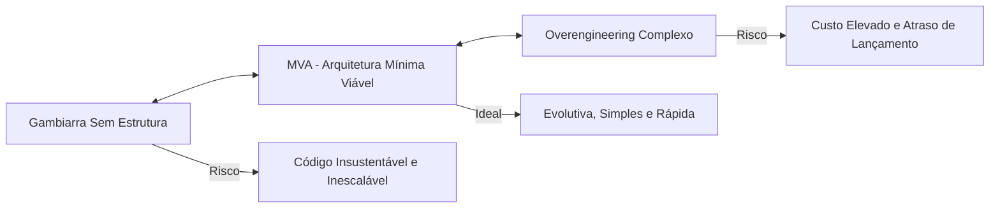

# 📖 Arquitetura Mínima Viável (MVA) no Módulo 2

## 🎯 1. O Conceito de MVP e MVA

No desenvolvimento moderno de produtos digitais, o tempo de lançamento (*Time-to-Market*) é vital para testar hipóteses de negócio.

* **MVP (Produto Mínimo Viável):** Versão enxuta de um produto criada com o objetivo de validar uma hipótese de negócio com usuários reais, investindo o mínimo de tempo e recursos.
* **MVA (Arquitetura Mínima Viável):** Estrutura técnica mínima, flexível e sustentável construída para suportar as operações do MVP sem desperdício de infraestrutura ou sobrecarga cognitiva.

---

## ⚖️ 2. O Dilema da Arquitetura em MVPs

O papel do arquiteto ao desenhar um MVP é encontrar o ponto de equilíbrio entre a velocidade de entrega e a sustentabilidade técnica do software:

| Abordagem | Características | Quando Ocorre | Impacto no Projeto |
| --- | --- | --- | --- |
| **Sub-Dimensionada** | Ausência de padrões, sem testes e sem separação de camadas. | Pressão extrema por prazos curtos. | Impossibilidade de escalar ou refatorar o MVP se for aprovado. |
| **Overengineering** | Microsserviços, Kubernetes e múltiplos bancos de dados para 100 usuários. | Ansiedade de arquitetar para escala de Big Techs antecipadamente. | Custo financeiro alto, lentidão de desenvolvimento e complexidade desnecessária. |
| **MVA (Ideal)** | Monólito modular, desacoplado, com pipeline de CI/CD simples e banco relacional. | Foco nos ASRs atuais, mantendo portas abertas para evolução. | Lançamento rápido e código preparado para crescer de forma orgânica. |

# 🔍 4. MVA no Contexto de Requisitos

Durante a fase de elicitação e análise de requisitos para um MVP, a MVA define o conjunto mínimo de Atributos de Qualidade a serem atendidos:

1. Foco em Segurança Básica: Autenticação e proteção de dados (LGPD) já devem nascer com o MVP.

2. Foco em Observabilidade Simplificada: Centralização básica de logs e alertas simples de disponibilidade.

3. Adiar Desempenho Extremo: Em vez de estruturas complexas de caching distribuído, utilize otimizações simples de consultas SQL até validar a carga real de acessos.

# 🚗 Analogia

🚚 O Food Truck como MVA de um Restaurante
MVP (Negócio): Vender um tipo específico de hambúrguer artesanal para testar se a receita agrada o público da cidade antes de alugar um imóvel comercial de luxo.

Sub-dimensionado (Gambiarra): Vender o hambúrguer em uma mesa dobrável na rua, sem higiene, sem gerador e sem caixa. Se chover ou a demanda subir, a operação colapsa instantaneamente.

Overengineering: Comprar um galpão industrial com cozinha de última geração de R$ 2 milhões e contratar 10 chefs antes de vender o primeiro sanduíche.

MVA (Arquitetura Mínima Viável): Adaptar uma van simples com chapa, geladeira funcional e máquina de cartão. A estrutura suporta a operação perfeitamente, atende às normas sanitárias essenciais e, se a receita for um sucesso, a cozinha pode ser migrada para um restaurante fixo sem perda de capital.