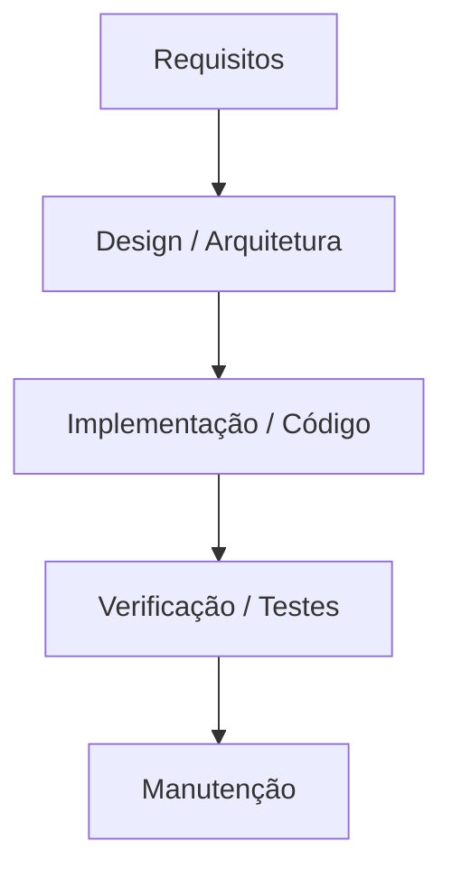

# 📖 Metodologia na Construção do Software no Módulo 2

As metodologias de desenvolvimento ditam como os requisitos do sistema são elicitados, documentados, priorizados e transformados em software funcional ao longo do tempo.

---

## 🌊 1. Modelo em Cascata (Waterfall)

O modelo tradicional e sequencial organiza o desenvolvimento em fases rígidas que devem ser concluídas sequencialmente antes da etapa seguinte iniciar.

*Impacto nos Requisitos (Módulo 2)*: Exige especificação massiva adiantada (Big Design Up Front). Requisitos congelados evitam escopo aberto, mas geram alto risco caso as necessidades do negócio mudem durante o projeto.

*Pontos Fortes*: Documentação rica, estimativas de prazo e custo previsíveis no início.

*Pontos Fracos*: Pouca flexibilidade para mudanças; validação do software com o cliente ocorre apenas no final.

# 🏃 2. Desenvolvimento Ágil (Agile)

O Manifesto Ágil prioriza software em funcionamento, colaboração e resposta rápida a mudanças em detrimento de documentação extensa e planos engessados.

## 🔄 Scrum
Framework focado em entregas incrementais dentro de intervalos de tempo fixos chamados Sprints (geralmente de 1 a 4 semanas).

Papéis:

*Product Owner (PO)*: Representa o negócio e prioriza os requisitos no Product Backlog.

*Scrum Master*: Facilita o processo e remove impedimentos da equipe.

*Time de Desenvolvimento*: Múltiplas especialidades focadas na entrega do incremento.

*Eventos Principais*: Sprint Planning, Daily Scrum, Sprint Review e Retrospectiva.

*Impacto nos Requisitos (Módulo 2)*: Os requisitos são detalhados na forma de User Stories dinâmicas no backlog, que podem ser reordenadas a cada Sprint conforme a prioridade da empresa muda.

# 📋 Kanban

Método visual de gestão focado na melhoria contínua e no fluxo contínuo de trabalho (sem Sprints de tempo fixo).

*Quadro Kanban*: Visualização do estado das tarefas (ex: A Fazer, Em Progresso, Em Teste, Concluído).

*Limite de WIP (Work in Progress)*: Restringe a quantidade de itens simultâneos em cada etapa para evidenciar gargalos e evitar sobrecarga da equipe.

*Impacto nos Requisitos (Módulo 2)*: Mudanças de prioridade entram diretamente na fila de entrada sem necessidade de aguardar um novo ciclo de planejamento.

# 🌀 3. Desenvolvimento Espiral (Spiral Model)

graph TD
    Q1[1. Determinar Objetivos] --> Q2[2. Análise e Mitigação de Riscos]
    Q2 --> Q3[3. Desenvolvimento e Validação]
    Q3 --> Q4[4. Planejar Próxima Fase]
    Q4 --> Q1

### 📐 Os 4 Quadrantes do Ciclo Espiral:

Determinar Objetivos: Elicitação das metas da iteração, alternativas e restrições.

Análise de Riscos: Identificação, prototipagem e mitigação de pontos críticos que podem inviabilizar o sistema.

Desenvolvimento e Testes: Construção do software e validação da versão atual.

Planejamento: Avaliação dos resultados pelo cliente e preparação da próxima volta na espiral.

Impacto nos Requisitos (Módulo 2): Os requisitos arquiteturais e de negócio são refinados continuamente a cada ciclo. Se um requisito trouxer alto risco técnico, ele é validado por um protótipo na primeira volta da espiral.

# 🚗 Analogia

*Modelo em Cascata*: Projetar do zero uma ferrovia inteira. Você escreve o projeto completo, assenta todos os trilhos, constrói a locomotiva e só descobre se o trem funciona no dia do término da obra, 5 anos depois.

*Desenvolvimento Ágil (Scrum/Kanban)*: Entregar primeiro um patinete, depois evoluir para uma bicicleta, depois para uma moto e finalmente um carro. O cliente usa a bicicleta na semana 2 e valida se ela resolve o deslocamento.

*Desenvolvimento Espiral*: Construir o protótipo de um foguete espacial. Antes de colocar combustível, você constrói uma maquete (Ciclo 1) para testar a aerodinâmica; depois um motor experimental (Ciclo 2) para testar riscos de explosão; e só avança para o produto final após eliminar os riscos de cada etapa.