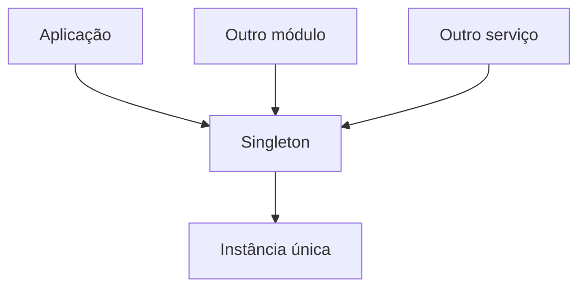
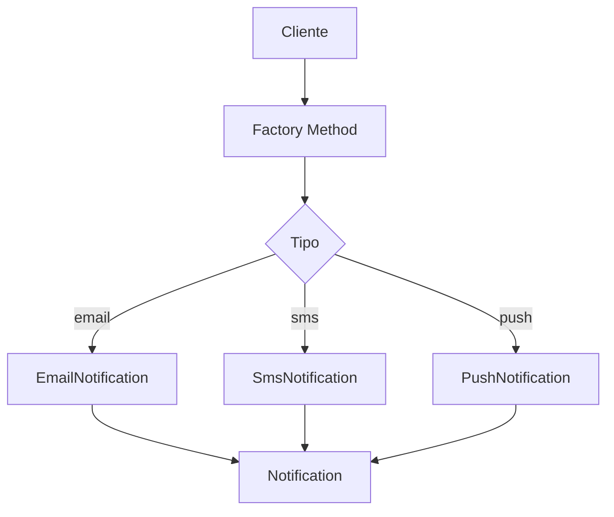
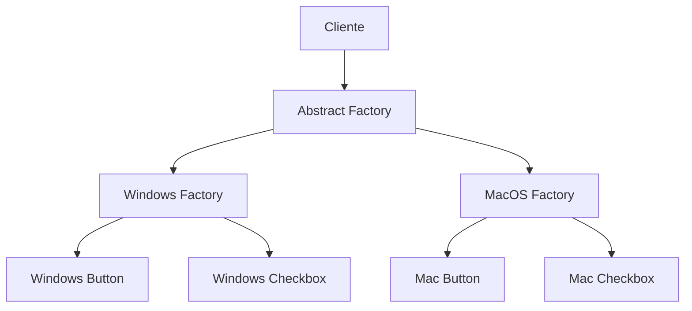
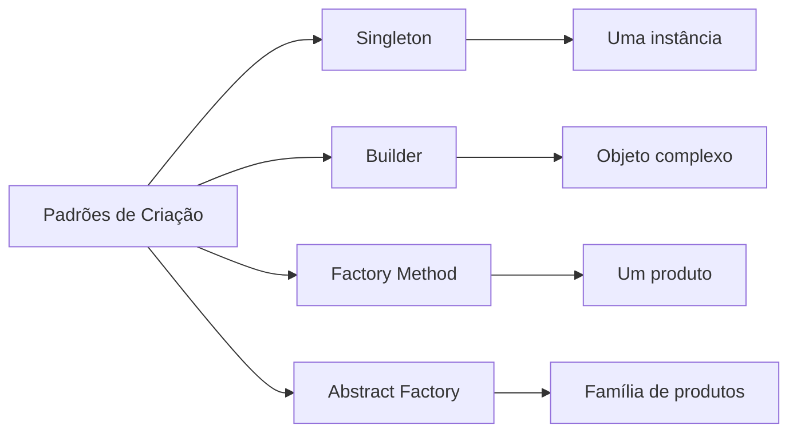

# GoF — Padrões de Criação

Os **Padrões de Criação (Creational Patterns)** fazem parte dos 23 padrões descritos pelo livro *Design Patterns: Elements of Reusable Object-Oriented Software*, desenvolvido pelo **Gang of Four (GoF)**.

O objetivo desses padrões é **organizar e controlar a criação de objetos**, evitando que a aplicação fique excessivamente acoplada às implementações concretas.

Em aplicações JavaScript, esses padrões continuam sendo úteis mesmo que a linguagem não utilize classes da mesma maneira que linguagens como Java ou C#.

> **Ideia central:** o problema não é simplesmente criar um objeto. O problema é decidir **como, quando e por quem esse objeto deve ser criado**.

---

## Padrões abordados

| Padrão               | Objetivo principal                     | Problema que resolve                                  |
| -------------------- | -------------------------------------- | ----------------------------------------------------- |
| **Singleton**        | Garantir uma única instância           | Evitar múltiplas instâncias de um mesmo recurso       |
| **Builder**          | Construir objetos complexos            | Evitar construtores ou objetos difíceis de montar     |
| **Factory Method**   | Delegar a criação de objetos           | Evitar acoplamento direto com classes concretas       |
| **Abstract Factory** | Criar famílias de objetos relacionados | Garantir que objetos compatíveis sejam criados juntos |

---

# 1. Singleton

O **Singleton** garante que determinada estrutura possua **uma única instância durante o ciclo de vida da aplicação**, fornecendo também um ponto centralizado de acesso a ela.

### Estrutura conceitual



Todos os consumidores acessam a mesma instância.

---

## Problema

Imagine que uma aplicação possua uma configuração global:

```javascript
const config = {
    database: "postgres",
    port: 5432
}
```

Se cada módulo criar sua própria instância de configuração, podemos acabar com diferentes estados:

```text
Módulo A → Configuração A
Módulo B → Configuração B
Módulo C → Configuração C
```

Isso pode gerar inconsistências.

O Singleton busca centralizar esse estado:

```text
             ┌───────────────┐
             │   Singleton   │
             │ Configuração  │
             └───────┬───────┘
                     │
        ┌────────────┼────────────┐
        ↓            ↓            ↓
    Serviço A    Serviço B    Serviço C
```

---

## Singleton em JavaScript

JavaScript possui características próprias que tornam a implementação do Singleton relativamente simples.

Um exemplo:

```javascript
class Database {
    constructor() {
        if (Database.instance) {
            return Database.instance
        }

        this.connection = "Conexão com PostgreSQL"

        Database.instance = this
    }

    connect() {
        console.log("Conectando ao banco...")
    }
}

const database1 = new Database()
const database2 = new Database()

console.log(database1 === database2)
// true
```

Mesmo utilizando `new` duas vezes, as duas variáveis apontam para a mesma instância.

---

## Singleton utilizando módulo

Em Node.js, muitas vezes nem precisamos implementar o padrão manualmente.

Podemos utilizar o próprio sistema de módulos:

```javascript
class Logger {
    log(message) {
        console.log(`[LOG] ${message}`)
    }
}

module.exports = new Logger()
```

Depois:

```javascript
const logger = require("./logger")
```

Outro arquivo:

```javascript
const logger = require("./logger")
```

Ambos recebem a instância exportada pelo módulo.

### Atenção

Isso não significa que **todo módulo seja automaticamente um Singleton em qualquer contexto**.

O comportamento depende do sistema de módulos e de como o módulo é carregado.

---

## Quando utilizar?

O Singleton pode ser útil para recursos que realmente precisam possuir uma única instância compartilhada, como:

* Logger;
* Configuração da aplicação;
* Gerenciadores de conexão;
* Cache centralizado;
* Gerenciadores de recursos.

### Quando evitar?

Singleton também é um padrão que deve ser utilizado com cuidado.

Um Singleton pode criar:

* estado global;
* forte acoplamento;
* dificuldade para testes;
* dependências ocultas;
* dificuldade de controlar o ciclo de vida.

> **Regra prática:** não utilize Singleton apenas porque "precisa acessar algo de vários lugares".

---

# 2. Builder

O **Builder** é utilizado para construir objetos complexos de maneira controlada e legível.

Ele é especialmente útil quando um objeto possui:

* muitos atributos;
* parâmetros opcionais;
* diferentes combinações;
* regras de construção;
* etapas de configuração.

---

## Problema

Imagine a criação de um usuário:

```javascript
new User(
    "Maicom",
    "maicom@email.com",
    26,
    "admin",
    true,
    "SC",
    "Brasil"
)
```

O problema começa quando o objeto possui muitos parâmetros.

É difícil saber o significado de cada argumento.

O Builder permite transformar isso em algo mais legível:

```javascript
const user = new UserBuilder()
    .setName("Maicom")
    .setEmail("maicom@email.com")
    .setAge(26)
    .setRole("admin")
    .setActive(true)
    .setState("SC")
    .setCountry("Brasil")
    .build()
```

Agora fica muito mais claro o que está sendo construído.

---

## Estrutura


---

## Implementação em JavaScript

```javascript
class User {
    constructor({
        name,
        email,
        age,
        role,
        active,
        state,
        country
    }) {
        this.name = name
        this.email = email
        this.age = age
        this.role = role
        this.active = active
        this.state = state
        this.country = country
    }
}

class UserBuilder {
    constructor() {
        this.user = {}
    }

    setName(name) {
        this.user.name = name
        return this
    }

    setEmail(email) {
        this.user.email = email
        return this
    }

    setAge(age) {
        this.user.age = age
        return this
    }

    setRole(role) {
        this.user.role = role
        return this
    }

    setActive(active) {
        this.user.active = active
        return this
    }

    setState(state) {
        this.user.state = state
        return this
    }

    setCountry(country) {
        this.user.country = country
        return this
    }

    build() {
        return new User(this.user)
    }
}
```

Utilização:

```javascript
const user = new UserBuilder()
    .setName("Maicom")
    .setEmail("maicom@email.com")
    .setAge(26)
    .setRole("admin")
    .setActive(true)
    .setState("SC")
    .setCountry("Brasil")
    .build()
```

---

## Por que retornar `this`?

Observe:

```javascript
setName(name) {
    this.user.name = name
    return this
}
```

O `return this` permite encadear métodos:

```javascript
builder
    .setName(...)
    .setEmail(...)
    .setAge(...)
```

Esse conceito é conhecido como **Method Chaining**.

---

## Builder não significa necessariamente classe

Em JavaScript, podemos implementar a ideia do Builder de diversas maneiras.

Por exemplo:

```javascript
function createRequestBuilder() {
    const request = {}

    return {
        method(method) {
            request.method = method
            return this
        },

        url(url) {
            request.url = url
            return this
        },

        body(body) {
            request.body = body
            return this
        },

        build() {
            return request
        }
    }
}
```

Utilização:

```javascript
const request = createRequestBuilder()
    .method("POST")
    .url("/users")
    .body({
        name: "Maicom"
    })
    .build()
```

Isso demonstra uma característica importante:

> **Design Pattern é uma solução conceitual. A implementação pode variar conforme a linguagem.**

---

# 3. Factory Method

O **Factory Method** define uma interface para criação de objetos, permitindo que a decisão sobre **qual objeto concreto será criado** seja delegada.

A ideia principal é remover do código cliente a responsabilidade de conhecer diretamente as implementações.

---

## Problema

Imagine um sistema que envia notificações.

Sem Factory:

```javascript
const email = new EmailNotification()

email.send()
```

Se posteriormente precisarmos suportar:

```text
Email
SMS
Push
WhatsApp
```

O código pode começar a acumular condicionais:

```javascript
if (type === "email") {
    notification = new EmailNotification()
}

if (type === "sms") {
    notification = new SmsNotification()
}

if (type === "push") {
    notification = new PushNotification()
}
```

O Factory Method busca encapsular essa decisão.

---

## Fluxo



---

## Exemplo em JavaScript

```javascript
class EmailNotification {
    send(message) {
        console.log(`Enviando EMAIL: ${message}`)
    }
}

class SmsNotification {
    send(message) {
        console.log(`Enviando SMS: ${message}`)
    }
}

class PushNotification {
    send(message) {
        console.log(`Enviando PUSH: ${message}`)
    }
}
```

Agora criamos a fábrica:

```javascript
class NotificationFactory {
    static create(type) {
        switch (type) {
            case "email":
                return new EmailNotification()

            case "sms":
                return new SmsNotification()

            case "push":
                return new PushNotification()

            default:
                throw new Error("Tipo de notificação inválido")
        }
    }
}
```

Uso:

```javascript
const notification = NotificationFactory.create("email")

notification.send("Olá!")
```

O código cliente não precisa conhecer:

```javascript
new EmailNotification()
```

Ele conhece apenas:

```javascript
NotificationFactory.create("email")
```

---

## Factory com Map

Em JavaScript, podemos utilizar recursos da própria linguagem para deixar a implementação mais simples:

```javascript
const notifications = {
    email: EmailNotification,
    sms: SmsNotification,
    push: PushNotification
}

function createNotification(type) {
    const Notification = notifications[type]

    if (!Notification) {
        throw new Error("Tipo inválido")
    }

    return new Notification()
}
```

Uso:

```javascript
const notification = createNotification("sms")
```

---

# 4. Abstract Factory

O **Abstract Factory** é utilizado quando precisamos criar **famílias de objetos relacionados ou compatíveis**.

Essa é a principal diferença em relação ao Factory Method.

### Factory Method

Normalmente resolve:

> "Qual objeto devo criar?"

### Abstract Factory

Resolve:

> "Qual família de objetos relacionados devo criar?"

---

# Exemplo: Interface gráfica

Imagine um sistema que pode utilizar diferentes temas:

```text
Windows
MacOS
Linux
```

Cada tema possui vários componentes:

```text
Button
Checkbox
Input
```

Precisamos garantir que os componentes pertençam à mesma família.

---

## Famílias

```text
Windows
├── WindowsButton
├── WindowsCheckbox
└── WindowsInput

MacOS
├── MacButton
├── MacCheckbox
└── MacInput
```

---

## Problema

Seria perigoso misturar:

```text
WindowsButton
+
MacCheckbox
+
LinuxInput
```

O Abstract Factory permite trabalhar com uma família inteira.

---

## Estrutura



---

## Implementação

### Produtos

```javascript
class WindowsButton {
    render() {
        console.log("Renderizando botão Windows")
    }
}

class WindowsCheckbox {
    render() {
        console.log("Renderizando checkbox Windows")
    }
```

```javascript
class MacButton {
    render() {
        console.log("Renderizando botão MacOS")
    }
}

class MacCheckbox {
    render() {
        console.log("Renderizando checkbox MacOS")
    }
}
```

---

## Fábricas

```javascript
class WindowsFactory {
    createButton() {
        return new WindowsButton()
    }

    createCheckbox() {
        return new WindowsCheckbox()
    }
}
```

```javascript
class MacFactory {
    createButton() {
        return new MacButton()
    }

    createCheckbox() {
        return new MacCheckbox()
    }
}
```

---

## Cliente

O cliente não precisa saber quais classes concretas estão sendo utilizadas:

```javascript
function renderApplication(factory) {
    const button = factory.createButton()
    const checkbox = factory.createCheckbox()

    button.render()
    checkbox.render()
}
```

Windows:

```javascript
renderApplication(new WindowsFactory())
```

MacOS:

```javascript
renderApplication(new MacFactory())
```

O código continua utilizando a mesma lógica.

---

# Factory Method × Abstract Factory

Essa é uma das diferenças mais importantes deste capítulo.

| Característica | Factory Method        | Abstract Factory                        |
| -------------- | --------------------- | --------------------------------------- |
| Cria           | Um produto            | Família de produtos                     |
| Foco           | Um tipo de objeto     | Objetos relacionados                    |
| Complexidade   | Menor                 | Maior                                   |
| Exemplo        | Criar uma notificação | Criar componentes de uma interface      |
| Objetivo       | Encapsular criação    | Garantir compatibilidade entre produtos |

### Resumindo

```text
Factory Method

        Factory
           │
           └── Produto


Abstract Factory

        Factory
        /     \
       ↓       ↓
   Produto A  Produto B
```

---

# Comparando os quatro padrões



| Padrão               | Pergunta que responde                 |
| -------------------- | ------------------------------------- |
| **Singleton**        | "Quantas instâncias devem existir?"   |
| **Builder**          | "Como construir esse objeto?"         |
| **Factory Method**   | "Qual objeto devo criar?"             |
| **Abstract Factory** | "Qual família de objetos devo criar?" |

---

# Os padrões em aplicações JavaScript

É importante não tentar reproduzir literalmente implementações de Java, C# ou outras linguagens dentro do JavaScript.

JavaScript possui mecanismos próprios que podem resolver parte desses problemas.

Por exemplo:

### Singleton

Pode ser obtido através de módulos:

```javascript
module.exports = new Service()
```

### Builder

Pode utilizar:

```javascript
method chaining
```

ou funções que retornam objetos configuráveis.

### Factory Method

Pode utilizar:

```javascript
function createService(type) {
    // ...
}
```

ou:

```javascript
Map
```

### Abstract Factory

Pode utilizar objetos que funcionam como fábricas:

```javascript
const factory = {
    createButton() {},
    createInput() {}
}
```

O importante é compreender **o problema que o padrão resolve**, e não simplesmente memorizar sua implementação.

---

# Relação com SOLID

Os padrões de criação possuem forte relação com princípios do **SOLID**, principalmente:

### Single Responsibility Principle

A responsabilidade de criação pode ser separada da responsabilidade de utilização.

```text
Antes:

Cliente
 ├── decide o tipo
 ├── cria objeto
 └── utiliza objeto
```

Com Factory:

```text
Cliente ──→ Factory ──→ Objeto
              │
              └── responsabilidade de criação
```

### Dependency Inversion Principle

O código cliente pode depender de uma abstração em vez de depender diretamente de uma implementação concreta.

```text
Evitar:

Cliente → EmailNotification


Preferir:

Cliente → Notification
              ↑
              │
       EmailNotification
```

Isso reduz o acoplamento e facilita a substituição de implementações.

---

# Quando utilizar cada padrão?

Uma forma simples de decidir:

```text
Preciso controlar a quantidade de instâncias?
            │
           SIM
            ↓
        Singleton


Preciso construir um objeto complexo?
            │
           SIM
            ↓
         Builder


Preciso escolher qual objeto criar?
            │
           SIM
            ↓
      Factory Method


Preciso criar vários objetos relacionados
e garantir que pertençam à mesma família?
            │
           SIM
            ↓
      Abstract Factory
```

---

# Analogia com o mundo real

Imagine uma **concessionária de veículos**.

## Singleton — A chave mestre

Imagine que a concessionária tenha **um único sistema central de controle de estoque**.

Todos os vendedores consultam o mesmo estoque:

```text
Vendedor A ─┐
Vendedor B ─┼──→ Sistema de Estoque Único
Vendedor C ─┘
```

Não faria sentido cada vendedor possuir uma cópia independente do estoque.

Isso representa a ideia do **Singleton**:

> Existe uma única instância compartilhada.

---

## Builder — Montando um carro

Agora imagine que você queira comprar um carro.

Você começa escolhendo:

```text
Modelo
↓
Motor
↓
Câmbio
↓
Cor
↓
Interior
↓
Rodas
↓
Acessórios
```

Você não precisa passar tudo de uma vez.

Pode construir o veículo passo a passo:

```text
CarroBuilder
    │
    ├── modelo("SUV")
    ├── motor("2.0")
    ├── cambio("Automático")
    ├── cor("Preto")
    ├── tetoSolar(true)
    │
    └── build()
          ↓
       Carro
```

Isso representa o **Builder**.

> O objeto é construído gradualmente até chegar ao estado final.

---

## Factory Method — Escolhendo o tipo de veículo

Agora imagine que você diga:

> "Quero um veículo para trabalho."

A concessionária decide qual veículo criar:

```text
Pedido
  ↓
Factory
  ↓
┌───────────────┐
│ Qual veículo? │
└───────┬───────┘
        │
   ┌────┼─────┐
   ↓    ↓     ↓
 Sedan SUV   Pickup
```

Você não precisa saber como cada veículo é criado.

Você apenas solicita:

```text
Factory → criar("pickup")
```

Isso representa o **Factory Method**.

---

## Abstract Factory — Escolhendo uma família

Agora imagine que uma empresa queira comprar uma **frota completa**.

Ela pode escolher:

```text
Família Econômica
├── Carro
├── SUV
└── Pickup
```

ou:

```text
Família Premium
├── Carro
├── SUV
└── Pickup
```

A empresa escolhe uma família e todos os veículos seguem aquele padrão.

```text
                 Factory
                    │
          ┌─────────┴─────────┐
          ↓                   ↓
    Econômica              Premium
       │                      │
   ┌───┼───┐              ┌───┼───┐
   ↓   ↓   ↓              ↓   ↓   ↓
 Carro SUV Pickup        Carro SUV Pickup
```

Isso representa o **Abstract Factory**:

> Uma fábrica responsável por produzir uma família de objetos relacionados.

---

# Resumo final

Os quatro padrões resolvem problemas diferentes:

```text
                 PADRÕES DE CRIAÇÃO
                         │
        ┌────────────────┼────────────────┐
        │                │                │
        ↓                ↓                ↓
    Quantidade        Construção       Seleção
        │                │                │
        ↓                ↓                ↓
    Singleton         Builder       Factory Method
                                           │
                                           ↓
                                  Família de objetos
                                           │
                                           ↓
                                   Abstract Factory
```

### Para memorizar

**Singleton**

> "Preciso de uma única instância."

**Builder**

> "Preciso construir algo complexo passo a passo."

**Factory Method**

> "Preciso decidir qual objeto criar."

**Abstract Factory**

> "Preciso criar uma família de objetos relacionados."

---

## Conclusão

Os padrões de criação não existem simplesmente para substituir `new`.

O objetivo é **controlar, organizar e desacoplar a criação de objetos**.

Em JavaScript, algumas implementações podem parecer diferentes das implementações tradicionais apresentadas em linguagens orientadas a objetos clássicas. Isso é esperado.

O mais importante é identificar o problema arquitetural:

```text
Criação simples
     ↓
new Object()


Criação complexa
     ↓
Builder


Criação variável
     ↓
Factory Method


Criação de famílias relacionadas
     ↓
Abstract Factory


Instância única compartilhada
     ↓
Singleton
```

A aplicação consciente desses padrões pode contribuir para sistemas mais **flexíveis, testáveis, manut**
