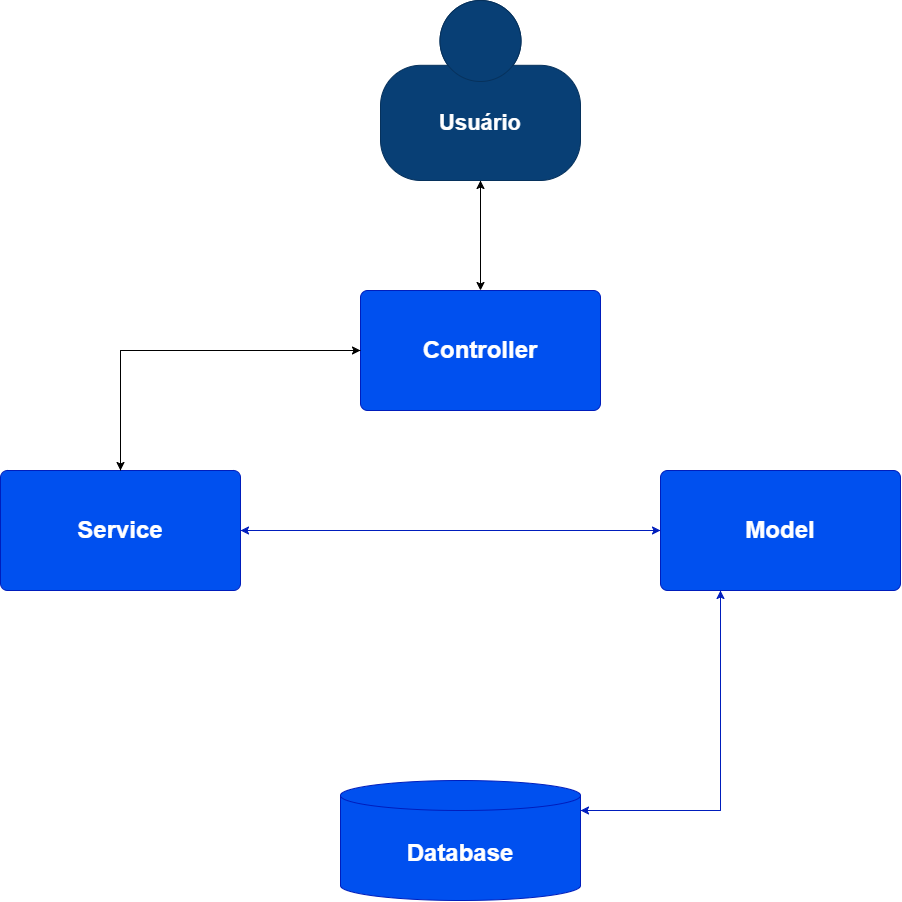

# Projeto Final - Pós-Módulo 1

## 📌 Sobre o Projeto

Aplicação REST para gerenciamento de produtos, permitindo realizar operações de criação, consulta, atualização e exclusão de produtos.

O projeto foi desenvolvido com foco na organização do código, separação de responsabilidades e aplicação do padrão arquitetural MVC.

---

## 🏗️ Arquitetura do Sistema

O projeto foi desenvolvido utilizando o padrão **MVC (Model-View-Controller)**, adaptado para uma aplicação **REST API**.

A arquitetura foi organizada de forma a separar as responsabilidades da aplicação, facilitando a manutenção, evolução e reutilização do código.

### Organização das Camadas

* **Routes:** responsável por definir os endpoints da API REST e direcionar as requisições para os respectivos controllers.

* **Controllers:** responsáveis por receber as requisições HTTP, realizar validações básicas dos dados de entrada, acionar os serviços e retornar as respostas HTTP para o cliente.

* **Services:** responsáveis pela lógica da aplicação, realizando a comunicação entre os controllers e os models.

* **Models:** responsáveis pelo acesso e manipulação dos dados no banco de dados PostgreSQL.

* **Config:** responsável pelas configurações da aplicação, incluindo a conexão com o banco de dados.

### Fluxo da aplicação

```text
Cliente
   │
   │ HTTP / JSON
   ▼
Routes
   │
   ▼
Controllers
   │
   ▼
Services
   │
   ▼
Models
   │
   ▼
PostgreSQL
```

Essa separação permite que cada camada tenha uma responsabilidade específica, evitando concentrar regras de negócio, acesso ao banco e tratamento das requisições em um único componente.

## 📁 Divisão dos Componentes

```text
src
├── config
│   └── dbConnect.js          # conexão com o banco de dados
│
├── controllers
│   └── productController.js  # responsável pelas requisições HTTP
│
├── models
│   └── productModel.js       # acesso ao banco de dados
│
├── routes
│   └── productsRoute.js      # definição das rotas REST
│
└── service
    └── productService.js     # lógica da aplicação
```

## 🚀 API REST

A aplicação disponibiliza endpoints para gerenciamento dos produtos, seguindo o padrão REST e utilizando códigos de status HTTP para representar o resultado das operações.

Entre as operações disponíveis estão:

* Criar produto
* Listar produtos
* Consultar produto por ID
* Consultar produto por nome
* Atualizar produto
* Excluir produto

## 📊 Diagrama Arquitetural

Abaixo é apresentado o diagrama C4 da aplicação:



# 📌 Documentação dos Endpoints da API

Abaixo encontra-se a especificação completa de todos os endpoints implementados na API REST.

---

## 📑 Tabela Resumo das Rotas

| Método | Endpoint | Descrição | Parâmetros / Body | Status Sucesso |
| :--- | :--- | :--- | :--- | :--- |
| `POST` | `/product` | Cria um novo produto | **Body:** `name`, `description`, `value` | `200 OK` |
| `GET` | `/allProducts` | Retorna todos os produtos registados | Nenhum | `200 OK` |
| `GET` | `/countProducts` | Retorna o total de produtos | Nenhum | `200 OK` |
| `GET` | `/product/:id` | Procura um produto pelo ID | **Params:** `id`[cite: 2] | `200 OK` |
| `GET` | `/product/name/:name` | Procura produtos pelo nome | **Params:** `name`[cite: 2] | `200 OK` |
| `PUT` | `/product/:id` | Atualiza os dados de um produto | **Params:** `id`<br/>**Body:** `name`, `description`, `value`[cite: 2] | `200 OK` |
| `DELETE` | `/product/:id` | Elimina um produto pelo ID | **Params:** `id`[cite: 2] | `200 OK` |

